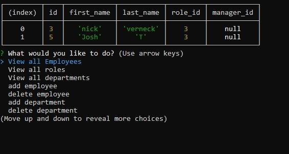

# Employee track CLI
  
## Description
this app uses NodejS,express & mySQl to create a employee tracker where you can asign roles, departments,managers , delete, update etc.
### walkthrough video
https://youtu.be/Ll6NHcs6_Mo
# 
## Table of Contents 
* [Installation](#installation)
* [Usage](#usage)
* [Contributing](#contributing)
* [Tests](#tests)
* [Questions](#questions)
## Installation
To install necessary dependencies, run the following command:
```
npm i
```
## Usage
there still some features in the making create issues if you find a bug

## Tests
To run tests, run the following command:
```
npm test
```
## Questions
If you have any questions about the repo, open an issue or contact me directly at nicollas@gmail.com. 
You can find more of my work at [nickverneck](https://github.com/nickverneck/).

